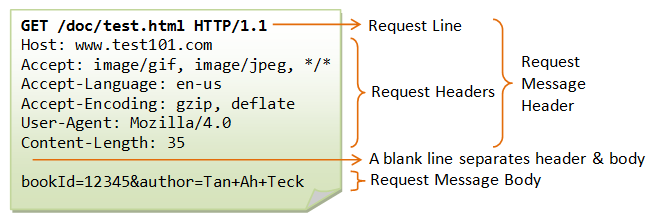

# Learning Nodejs Web-servers

## 00 - Prerequisites

1. Install Homebrew: https://brew.sh
2. Install `httpie`: `brew install httpie`

## 01 - Node Standard-Library packages

1. Instantiate an http server
2. Respond to requests with an HTML "Hello World"

## 02 - HTTP Framework: Polka

Polka is a minimal express.js (an older, more established alternative) style webserver framework. [polka](https://www.npmjs.com/package/polka)

1. Install Polka
2. Instantiate an HTTP server using Polka
3. Respond to requests with an HTML "Hello World"

## 03 - Static Assets

Sirv is a minimal static-asset middleware server for express-like webserver frameworks. It's produced by the same developer as `polka` [sirv](https://www.npmjs.com/package/sirv)

1. Create a new Polka app
2. Create a basic HTML webpage in `/public`
3. Use `sirv` to create a static-asset middleware for the `public` folder
4. Pass the `sirv` middleware into your `app` via `app.use`
5. Go to your webserver in a browser

## 04 - Middleware

Middleware is software, in the context of http-servers, that lies between the initial HTTP request that came over the wire and the eventual response to be sent back over that wire. The most common pattern for webserver middleware is a simple function

that takes in 3 arguments: Request, Response, and a next callback. the expectation is that next() be called after all processing is done, which will tell the framework calling **your** middleware to call the **"next"** middleware.

The idea is to let as many middleware handles as needed access each request

1. Create a new Polka App
2. Create a static-asset server (see 03)
3. Add a _middleware_ function with `app.use`
4. Navigate to your webserver in the browser

## Primer - Hyper-Text Transfer Protocol: what's it look like?

HTTP is a plain text transfer-protocol, it's totally human-readable

use `curl` to send a request to google.com

```sh
curl --verbose "http://google.com/search?q=foobar"

> GET /search?q=foobar HTTP/1.1
> Host: google.com
> User-Agent: curl/7.64.1
> Accept: */*
>
< HTTP/1.1 301 Moved Permanently
< Location: http://www.google.com/search?q=foobar
< Content-Type: text/html; charset=UTF-8
< Date: Sun, 28 Nov 2021 18:18:35 GMT
< Expires: Tue, 28 Dec 2021 18:18:35 GMT
< Cache-Control: public, max-age=2592000
< Server: gws
< Content-Length: 234
< X-XSS-Protection: 0
< X-Frame-Options: SAMEORIGIN
<
<HTML><HEAD><meta http-equiv="content-type" content="text/html;charset=utf-8">
<TITLE>301 Moved</TITLE></HEAD><BODY>
<H1>301 Moved</H1>
The document has moved
<A HREF="http://www.google.com/search?q=foobar">here</A>.
</BODY></HTML>
```

Above we have `>` lines showing the request we've sent and `<` lines showing the response back. Below is an image showing what the different parts of the request are.



## 05 - HTTP Verbs

So far, our server has been responding to GET requests. In our second lesson we explicitly put `app.get` meaning the handler passed in is triggered exclusively on requests starting with GET. This is the most common type of request, but HTTP specifies other request methods (or verbs) that can send more data in a **request body**. We're going to start handling POST requests, the second most abundant request type, typically associated with saving data onto the server.

1. Create a new Polka app
2. Mount `/public` to the `/` level of your app
3. Log all incoming requests with an `app.use` _middleware_
4. handle `GET` requests to `/` on your app
5. handle `POST` requests to `/` on your app
6. Using `httpie`, make requests to both of your endpoints [(See docs)](https://httpie.io/docs#http-method)
   1. `http localhost:8080/`
   2. `http POST localhost:8080/`

### Play around

Take note of the fact that handlers for different http methods are not executed even though the paths match. Put some console.log calls in your code so you can see what's happening. add in some other verbs to your app.

### Further Reading

- [MDN: HTTP Methods](https://developer.mozilla.org/en-US/docs/Web/HTTP/Methods)
- [w3schools: HTTP Methods](https://www.w3schools.com/tags/ref_httpmethods.asp)

## 06 - Request Body / Server Data

There is a concept in data management, CRUD, that describes the 4 basic functions a data-model _could_ implement for storage _at most_: Create, Read, Update, Delete. Historically, HTTP api engineers have mapped these functions 1-to-1 with HTTP methods: GET=read, POST=create, PUT=update, and DELETE=delete. There's nothing forcing this match up, and as you can see in the official docs there are a lot more http methods than CRUD can account for but being aware of this match up can help you understand what other api designers are thinking, so I would recommend committing the associate to memory.

With that knowledge, specifically that POST and PUT are meant to save data, we need to have that data in the request, that is what the **request body** is for. Unfortunately for us, there are literally countless ways for the request body to be formatted, it could be literally anything, so typically a header is included specifying a **MIME-type** (something that looks like `___/___`). The most common MIME-types are `application/x-www-form-urlencoded`, `application/json` and `text/plain`, and in our JavaScript servers, by far the most common would be `application/json`.

To handle request bodies we include simply need another middleware, called a **body-parser**, that parses the request body into javascript and attaches it to our `req` argument in our routing handlers. The most well-established package for this is the obviously named `body-parser` so let's install that as well as `polka`.

1. Create a new Polka app
2. Create logger middleware
3. Add the body-parser `text` middleware [documented here](https://www.npmjs.com/package/body-parser#bodyparsertextoptions)
4. Add a USERS collection (Just an array of names as strings)
5. Add a `POST` handler for `/user`
   1. Save the `req.body` to the USERS collection
   2. Respond with the user's name and array index as fields in an object
   3. Hint: `.push()` returns the index
6. Add a `GET` handler for `/user`
   1. Respond with the array of USERS
7. Test your api with `httpie`
   1. Send a GET request with `httpie`
      - `http localhost:8080/user`
   2. Send a POST request with `httpie` with a new name as the body
      - `http POST localhost:8080/user Content-Type:text/plain --raw=Jack`
   3. Send another GET request
      - `http localhost:8080/user`

### Play around

I've opted for `text/plain` in this lesson so that we don't need to create JSON manually. `httpie` supports sending files instead of `--raw` so make a .json file, change the body parser to `json()` instead of `text()` and send a fancier request body.

## XX - Dynamic routing

// About request parameters

1. Create a new Polka app
2. Handle requests to `/api/:name/:location`
   1. Save the `name` and `location` fields from the `req.params` object in variables
   2. Respond with the provided `name` and `location` fields
3. Using `httpie` test your endpoint `/api/:name/:location` by replacing `:name` with your name and `:location` with your own.

## XX - Response Codes

// About HTTP Response Codes
[HTTP response status codes](https://developer.mozilla.org/en-US/docs/Web/HTTP/Status)

1. Set up the app using the same setup as the previous lesson: **07 Server Data**
2. in your `POST /api/:name` handler:
   1. Add a check to ensure `name` includes only ascii alphabetic characters (A-Z)
   2. Respond with `400 Bad Request` if name includes non-alpha characters
3. in your `GET /api/:name` handler:
   1. Respond with `404 Not Found` if `req.params.name` is not in the USERS collection

## XX - Client / Server interaction

1. Setup a static asset server using Polka
2. Add 4 anchor-tag links to the HTML document body:
   1. Point each link to `/search?q=` and a different name for each
3. In your server, add a handler for the `GET /search` path,
4. Save the value of the `req.query.p` field to a local variable
5. Respond with `{ q: ___ }` replacing `___` with your local variable name
6. Go to your page in a browser and click the links

## XX - Client / Server interaction with `fetch`

1. Create a new Polka app Static Asset Server
   1. Add a new HTML document with only a script:src tag to your `/public` folder
   2. In the referenced script tag use `fetch` in the client browser to make requests to `/hello`
   3. use the `.then` property chain returned by `fetch` to add a response handler
   4. In the response handler add a new `p` tag to the document body and add the text content from the response body
2. In your server:
   1. Create a new `GET /hello` endpoint that simply replies with `Hello, world"
